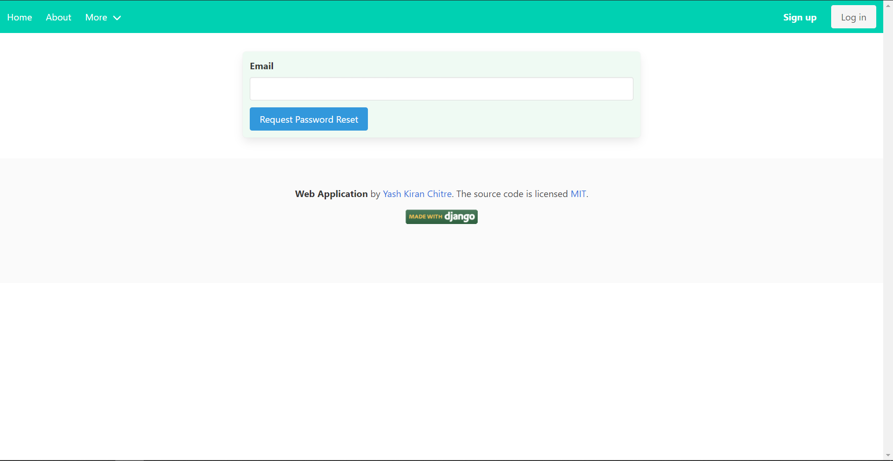

# Social Web Application
> A complete web application built on the Django framework in Python. 
> Includes right from the visual front-end to the proxy servers, business logic and finally, the database. 
> Please post any issues, bugs, tips for this project.

## Table of contents
* [General info](#general-info)
* [Screenshots](#application-screenshots)
* [Technologies](#technologies)
* [Setup](#setup)
* [Features](#features)
* [Status](#status)
* [Inspiration](#inspiration)
* [Contact](#contact)

## General info
Looking at the many blog web applications being developed and as many tutorials with it, I wanted to build my own web application while learning the Django framework. 
The purpose of this project was to develop a social/blog style web application.
The idea was to build a platform where people could share their approach on various coding challenges as well as small tutorials easily.
Hence, this web application contains many features to facilitate this ease-of-use and will be explained in detail later.

## Application Screenshots

## Technologies

### Front-end
* HTML
* Bulma CSS
* Javascript

### Back-end
* Nginx proxy server
* Python 3
* Django 3

### Databases
* SQLite (developing)
* PostgreSQL (production)

### Containerization
* Docker
* Docker-compose
* Docker stack

### Cloud services
* AWS EC2
* AWS RDS
* AWS ECR
* AWS S3
* AWS Lambda
* Gmail SMTP

## Setup
To set up the project, make sure to install Docker and start all the necessary AWS instances given in [Technologies](#technologies).
Then simply run the `runproject` script in the scripts' folder.

## Code Examples
Show examples of usage:
`put-your-code-here`

## Features
List of features ready and TODOs for future development
* Update profile
  

* Report issues
  
  
* Create new post/article
  
  
* Delete account
  
  
* Create new account
  
  
* Login with existing account
  
  
* Reset account password
  
  
* Pagination
  
  
* Like, comment, and edit your posts
  
  
* Individual user article search
  
  
* Tag posts and search by tags
  
  
* Search by content
  
  
* Search by title
  
  
* Mobile-view support
  
  
  
  
  

Future scope:
* Add social websites' authentication.
* Redo the project with Django REST framework.

## Status
Project is: _finished_ (may add features or patch bugs whenever necessary in the future).

## Inspiration
[Corey Schafer's Django tutorials](https://www.youtube.com/user/schafer5), hundreds of medium posts, articles, and reddit community.

## Contact
[@yashchitre03](https://www.linkedin.com/in/yashchitre03/) - feel free to contact me!