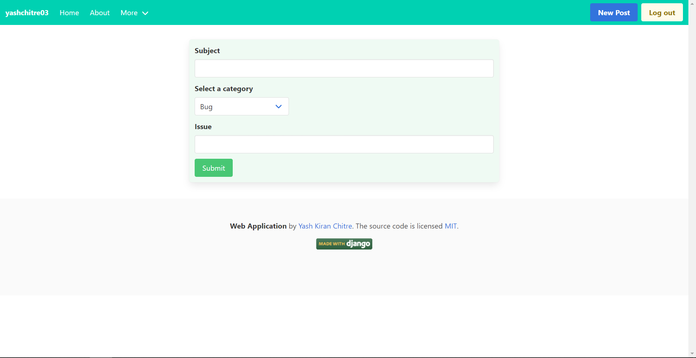

# Social Web Application
> A web application built on the Django framework in Python. 
> Includes different components from the visual front-end to the proxy servers, main logic, and the database. 
> Please post any issues, bugs, tips for this project.

## Table of contents
* [General Info](#general-info)
* [Application Screenshots](#application-screenshots)
* [Technologies](#technologies)
* [Setup](#setup)
* [Features](#features)
* [Status](#status)
* [Inspiration](#inspiration-and-tutorials)
* [Contact](#contact)

## General info
Looking at the many blog web applications being developed and as many tutorials with it, I wanted to build my own web application while learning the Django framework. 
The purpose of this project was to develop a social/blog style web application.
The idea was to build a platform where people could share their approach on various coding challenges as well as small tutorials easily.
Hence, this web application contains many features to facilitate this ease-of-use such as markdown code formatting, like and comment models, etc.

## Application Screenshots
* Home page


  
* About web-page


* Logout acknowledgement

  
* Markdown cheatsheet


## Technologies

### Front-end
* HTML
* Bulma CSS
* Javascript

### Back-end
* Nginx proxy server
* Python 3
* Django 3

### Databases
* SQLite (developing)
* PostgreSQL (production)

### Containerization
* Docker
* Docker-compose
* Docker stack

### Cloud services
* AWS EC2
* AWS RDS
* AWS ECR
* AWS S3
* AWS Lambda
* Gmail SMTP

## Setup
To set up the project,
* Install and setup docker and aws cli (preferably on a Linux environment). 
* Start the required [AWS services](#cloud-services) or setup similar local services (modify the startup script accordingly).
* Finally, simply run the `runproject` script in the scripts' folder.

## Code Examples
* User registration form
```python
class UserRegisterForm(UserCreationForm):
    """
    Form for the user signup page.
    """
    email = forms.EmailField()

    class Meta:
        model = get_user_model()
        fields = ['username', 'email', 'password1', 'password2', ]
```

* User profile database model
```python
class Profile(models.Model):
    """
    User Profile Model for profile pictures.
    """
    user = models.OneToOneField(get_user_model(), on_delete=models.CASCADE)
    image = models.ImageField(default='default.jpg', upload_to=image_file_path)

    class Meta:
        pass

    def __str__(self):
        return f'{self.user.username} Profile'

```

* New account signal processing
```python
@receiver(post_save, sender=get_user_model())
def create_profile(sender, instance, created, **kwargs):
    """
    Creates the default profile after a new user is created.
    """
    if created:
        new = Profile.objects.create(user=instance)
        new.save()
```

* Delete user function based view
```python
@login_required
def delete_user(request):
    """
    View for the user account deletion process.
    """
    if request.method == 'POST':

        if request.POST.get('action') == 'delete':
            request.user.delete()
            messages.success(
                request, 'Your account has been deleted successfully')
            return redirect('blog-home')

        else:
            return redirect('profile')

    else:
        return render(request, 'users/delete_user.html')
```

* Detailed post/article class based view
```python
class PostDetailView(View):
    """
    Passes the request to an appropriate view.
    View is for an individual post.
    """

    def get(self, request, *args, **kwargs):
        """
        Redirects to the PostContent view when a GET request is received.
        """
        view = PostContent.as_view()
        return view(request, *args, **kwargs)

    def post(self, request, *args, **kwargs):
        """
        Redirects to the PostComment view when a POST request is received.
        """
        view = PostComment.as_view()
        return view(request, *args, **kwargs)
```

* Test cases
```python
class CommentFormTest(TestCase):

    def testFormIsValid(self):
        """
        tests whether the comment form is valid for text following the constraints.
        """
        content = 'This is a test comment'
        form_data = {'content': content}
        form = CommentForm(data=form_data)
        self.assertTrue(form.is_valid())

    def testFormIsNotValid(self):
          """
        tests whether the comment form is invalid for text exceeding the constraints.
        """
        content = 'This is a test comment' * 12
        form_data = {'content': content}
        form = CommentForm(data=form_data)
        self.assertFalse(form.is_valid())
```

* Django dockerfile
```dockerfile
FROM python:3.8-alpine

ENV PATH="/scripts:${PATH}"

COPY ./requirements.txt /requirements.txt
RUN apk add --update --no-cache --virtual .tmp gcc libc-dev linux-headers
RUN apk add --no-cache jpeg-dev zlib-dev
RUN apk add postgresql-dev
RUN pip install -r /requirements.txt
RUN apk del .tmp

RUN mkdir /app
COPY ./DjangoProject /app
WORKDIR /app
COPY ./scripts /scripts

RUN chmod +x /scripts/*

RUN mkdir -p /vol/web/media
RUN mkdir -p /vol/web/static
RUN adduser -D user
RUN chown -R user:user /vol
RUN chmod -R 755 /vol/web
USER user

CMD ["entrypoint.sh"]
```

* Project startup script
```shell
aws ecr get-login-password --region us-east-1 | docker login --username AWS --password-stdin $DOCKER_REGISTRY

docker build -t django/app .
docker tag django/app:latest $DOCKER_REGISTRY/django/app:latest
docker push $DOCKER_REGISTRY/django/app:latest

docker build -t django/proxy .
docker tag django/proxy:latest $DOCKER_REGISTRY/django/proxy:latest
docker push $DOCKER_REGISTRY/django/proxy:latest

CMD="docker stack deploy -c $DOCKER_COMPOSE_YML ec2 --with-registry-auth"
DOCKER_HOST="ssh://$HOST" $CMD
```

## Features

### Implemented
* Update profile
  

* Report issues
  
  
* Create new post/article
  
  
* Delete account
  
  
* Create new account
  
  
* Login with existing account
  
  
* Reset account password
  
  
* Pagination
  
  
* Like, comment, and edit your posts
  
  
* Individual user article search
  
  
* Tag posts and search by tags
  
  
* Search by content
  
  
* Search by title
  
  
* Mobile-view support
  
  Mobile view           |  Mobile view
  :-------------------------:|:-------------------------:
    |  
    |  
    |  

### Future scope / ToDo:
* Make the application more secure with random post id.
* Redo the backend part of the project with Django REST framework as a REST API.

## Status
Project is: _finished_ (may add features or patch bugs whenever necessary in the future).

## Inspiration and Tutorials
[Corey Schafer's Django tutorials](https://www.youtube.com/user/schafer5), medium articles, articles, and reddit community.

## Contact
[@yashchitre03](https://www.linkedin.com/in/yashchitre03/) - feel free to contact me!
